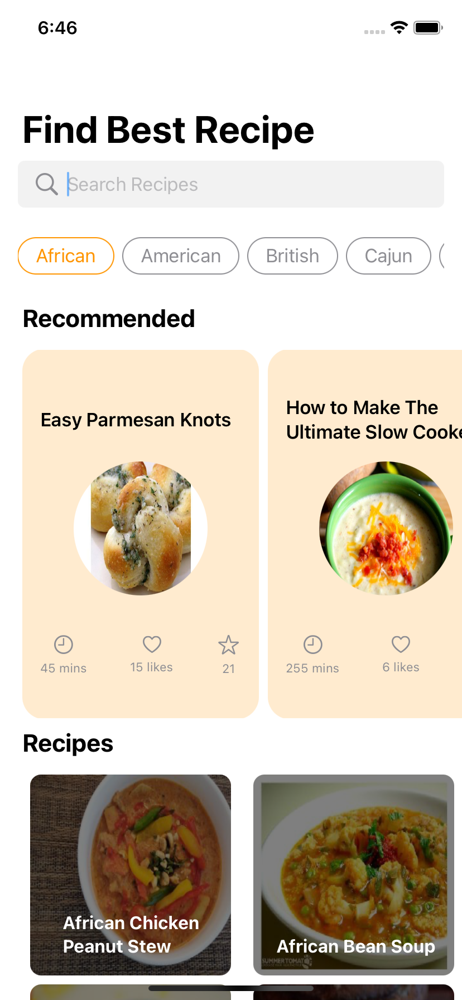
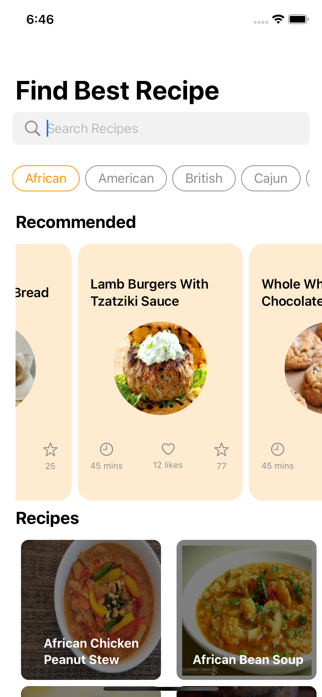
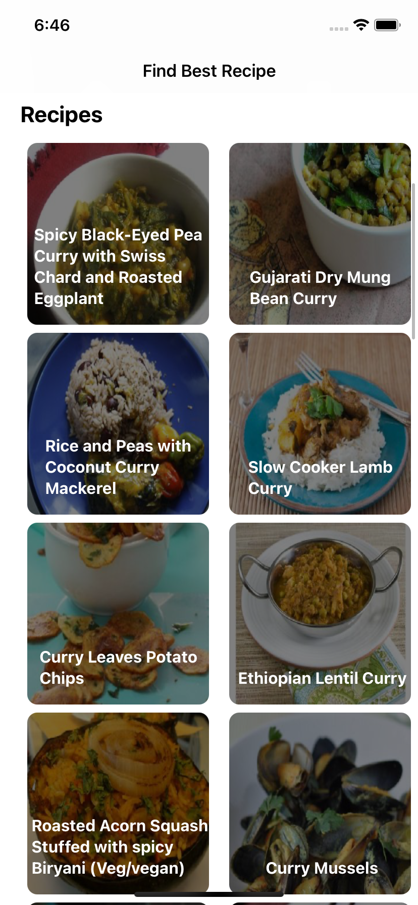
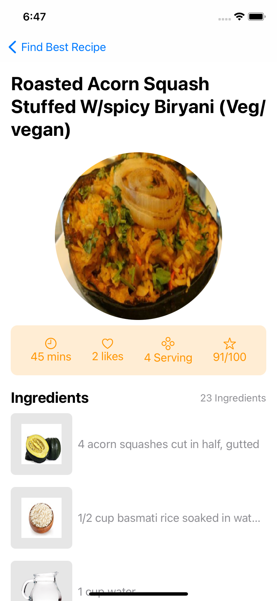
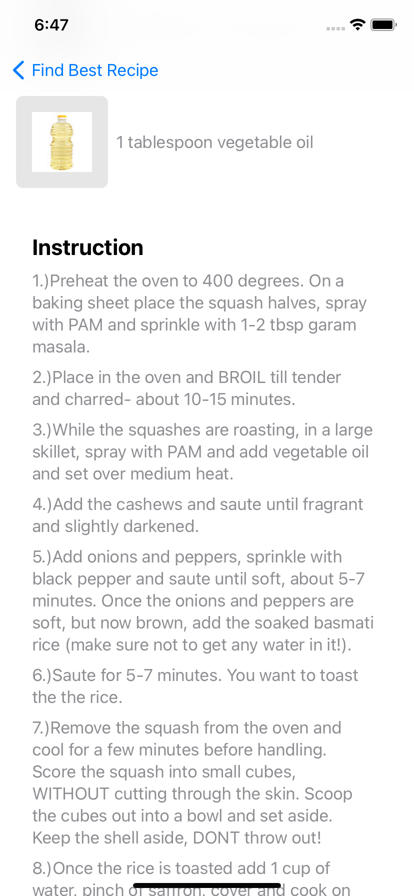
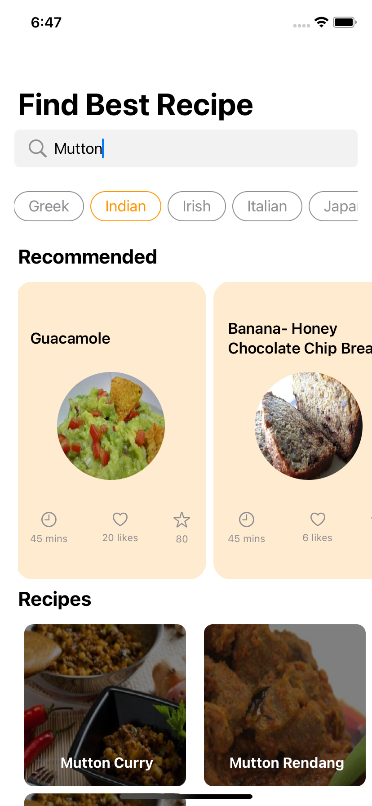

# Recipes_SwiftUI
Simple Recipe app using SwiftUI and spoonacular api.

<table>
  <tr>
    <td></td>
    <td></td>
    <td></td>
  </tr>
 </table>
 
 <table>
  <tr>
    <td></td>
    <td></td>
    <td></td>
  </tr>
 </table>
